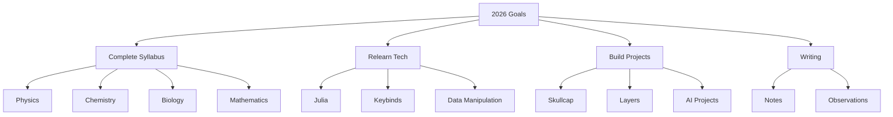

<div align="center">
<pre>
 ▄▄▄·  ▐ ▄ ·▄▄▄▄      .▄▄ · ▄▄▄▄▄▪  ▄▄▌  ▄▄▌      ▪      ▄▄▄  ▪  .▄▄ · ▄▄▄ .
▐█ ▀█ •█▌▐███▪ ██     ▐█ ▀. •██  ██ ██•  ██•      ██     ▀▄ █·██ ▐█ ▀. ▀▄.▀·
▄█▀▀█ ▐█▐▐▌▐█· ▐█▌    ▄▀▀▀█▄ ▐█.▪▐█·██▪  ██▪      ▐█·    ▐▀▀▄ ▐█·▄▀▀▀█▄▐▀▀▪▄
▐█ ▪▐▌██▐█▌██. ██     ▐█▄▪▐█ ▐█▌·▐█▌▐█▌▐▌▐█▌▐▌    ▐█▌    ▐█•█▌▐█▌▐█▄▪▐█▐█▄▄▌
 ▀  ▀ ▀▀ █▪▀▀▀▀▀•      ▀▀▀▀  ▀▀▀ ▀▀▀.▀▀▀ .▀▀▀     ▀▀▀    .▀  ▀▀▀▀ ▀▀▀▀  ▀▀▀  ▀
</pre>

# Greetings, Comrade in life!

[](https://youtu.be/CFxNDTlIt_w)

</div>

---

## 🚀 About Me


```ruby
class Developer
  attr_accessor :name, :role, :languages, :interests, :current_project

  def initialize
    @name = "Satvik Anand"
    @role = "Student & Developer"
    @languages = []
    @interests = []
    @current_project = "Final Exams!"
  end

  def say_hi
    puts "Thanks for dropping by! Let's build something amazing together!"
  end
end

me = Developer.new
me.say_hi
````

---

## 📊 GitHub Stats


---

## 🏆 GitHub Trophies


---

## 🎯 Current Goals



---

## 🐍 Contribution Graph


---

## 🌟 Featured Projects

> 🚧 **None for now**
---

## 📫 Let's Connect!

<div align="center">

[](https://www.linkedin.com/in/satvik64/)
[](https://dirtbag128.github.io/notes-and-such/)
[](mailto:anandsatvik11313@gmail.com)
[](https://discord.com/users/699269054774509660)

</div>

---

<div align="center">

### 👀 Profile Views


</div>

```
Never Give Up.
```
